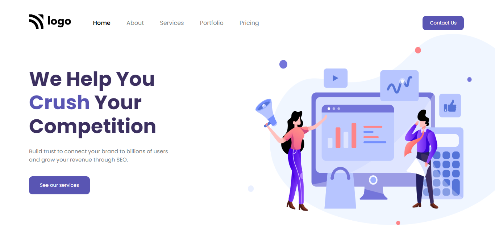

# Digital Marketing Home Page

***
## Description

This project [Digital Marketing Home Page]() was built using Semantic HTML and CSS. While building this project I learnt more about **flexbox** and **positions**. Also used various Css properties like **box-shadow**, border-radius, margins, etc. The Project was completed under guidance of [Hitesh Choudhary](https://github.com/hiteshchoudhary), CTO Ineuron

***

### Links for Project

* [LIVE Project Link]()

* [Youtube Video Demo]()

* [Source Code]()

***
### Built With 

* Semantic HTML
* Custom CSS classes
* FlexBox
* Positions

***

### Key Learnings

* Learned to use box shadow on [buttons](https://developer.mozilla.org/en-US/docs/Web/CSS/box-shadow)
* Learned using [flexbox](https://developer.mozilla.org/en-US/docs/Web/CSS/flex)
* Learned to use [positions](https://developer.mozilla.org/en-US/docs/Web/CSS/position)(absolute & relative)

***

### Time Taken to finish this project
 

>1.5 hours

 

***

### Screencapture of Project

 

***
 

### Checkout Portfolio & Other Projects
 

#### [Personal Portfolio]()

#### [Findcoder Profile]()
***

### Connect with Me
* [Mailto](mailto:shubhambhoj3@gmail.com)
* [LinkedIn]()
* [Github]()
* [Findcoder]()
***
***
[go to top](#digital-marketing-home-page)